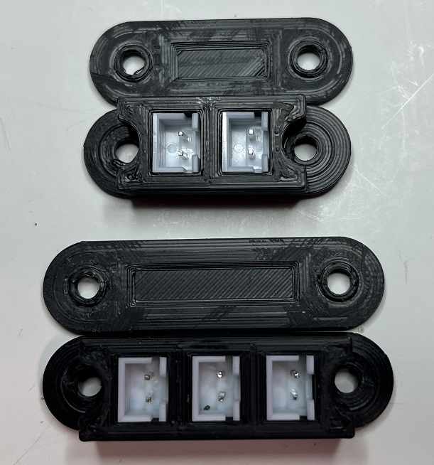
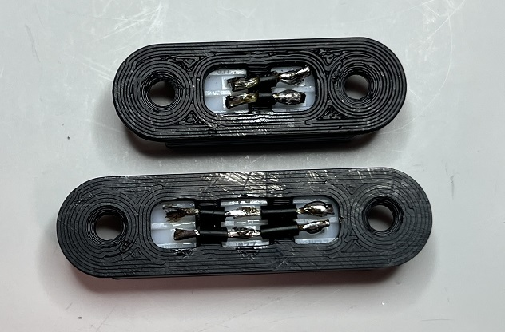
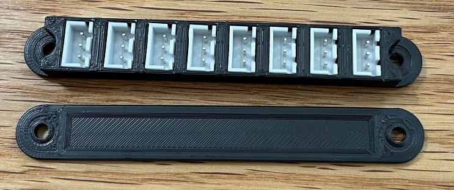
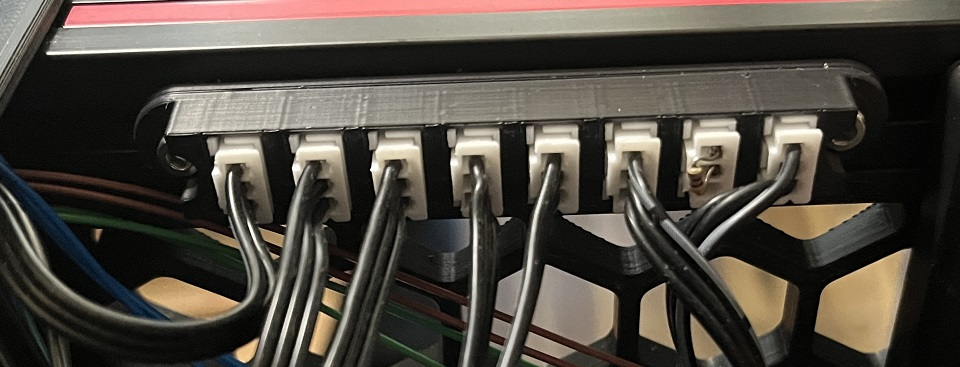
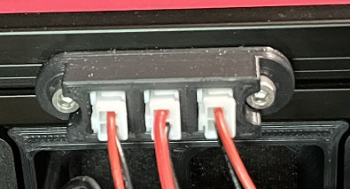
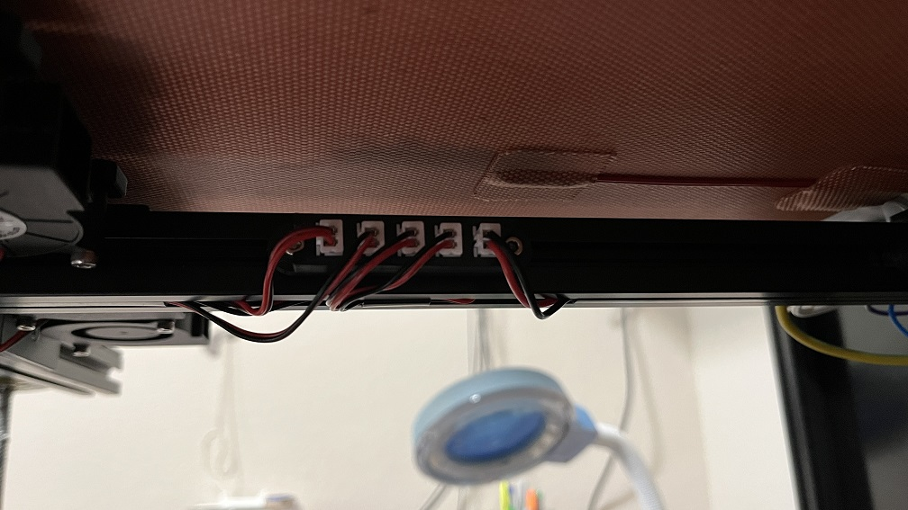
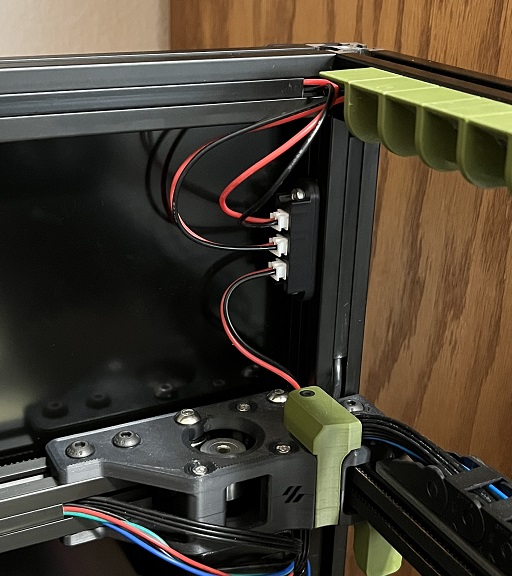

## JST-XH Extrusion Mounts

These mounts are for making a JST-XH splitter (1->2) or bus (1->many).

### Credit
Design idea came from Tehtsuo (Voron Discord), however these were drawn from scratch in Fusion 360.

### File locations
- CAD folder -- F3D and STEP files
- Mesh folder -- 3MF and STL files

### Naming scheme
- JST-XH-2-2 - two slots: both two-pin -- used as a disconnect for bed thermister
- JST-XH-2-2-2 - three slots: all two-pin -- used as one-to-two power splitter for electronics bay fans
- JST-XH-2-2-2-2 - four slots: all two-pin -- used for one-to-three power-splitter for three bed fans
- JST-XH-2-2-2-2-2 - five slots: all two-pin -- used as one-to-four power-splitter for four bed fans
- JST-XH-3-2-2 - three slots: three-pin followed by a pair of two-pin -- used as breakout for X and Y endstops sharing a common line (e.g. you used the XY endstop PCB for your Trident)
- JST-XH-3-3-3-3-3-3-3-3 - eight slots: all three-pin -- used as a data bus for DS18B20 1wire temp sensors

### BOM
- QTY=2 M3 T-nut (roll-in or hammerhead)
- QTY=2 M3x8 screw (SHCS or BHCS)
- JST-XH male connectors (can be found on Amazon or other electronics supply chains)
