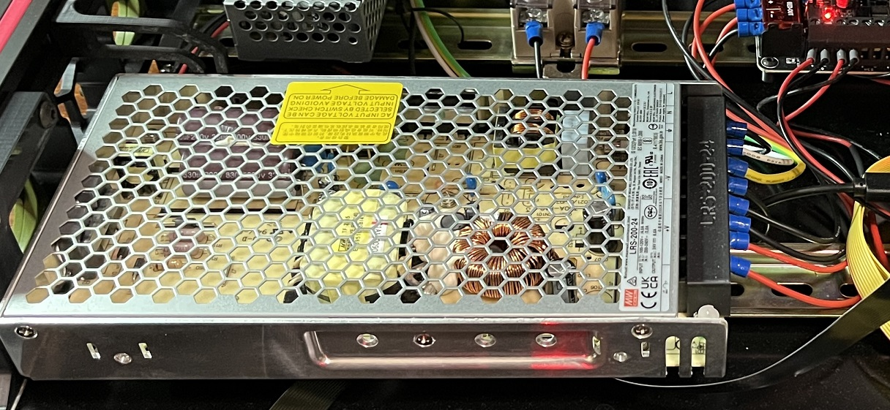

## LRS-200 Terminal Cover

This is a cover for the LRS-200 power supply to keep fingers off of exposed mains screws.

### Credit
This is based on the work by Samwiseg0 -- https://github.com/VoronDesign/VoronUsers/tree/master/printer_mods/samwiseg0

I had to thin the walls on the outer edges so that the cover would slip between the terminal block and the power supply frame and also not crowd the voltage adjust trim screw.

### File locations
- CAD folder -- F3D and STEP files
- Mesh folder -- 3MF and STL files
