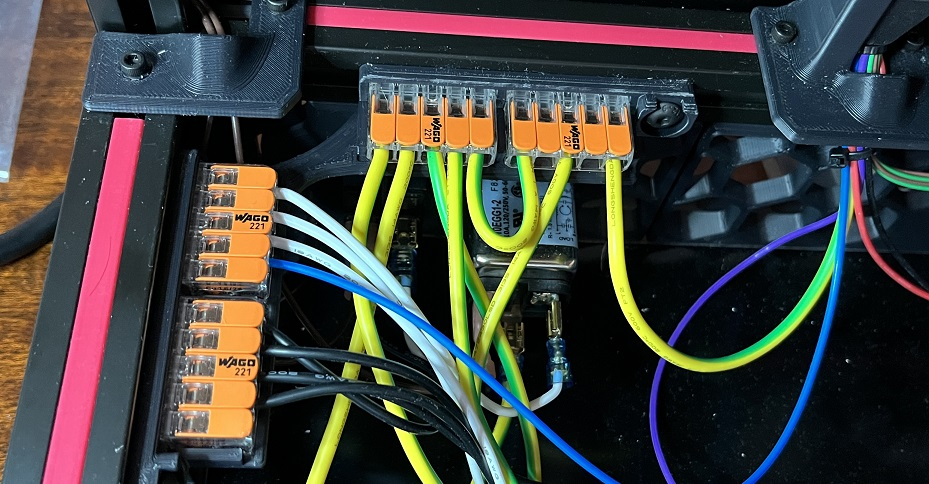

## Wago 4x 221-415 mount

This mount is to use four Wagos in the Voron Trident electronics bay instead of three. I needed a fourth one to expand the number of connectors for ground.

### Credit
This is a modification of the original Voron CAD work.

### File locations
- CAD folder -- F3D and STEP files
- Mesh folder -- 3MF and STL files

### BOM
- QTY=4 Wago 221 415 Lever Nuts
 (where build manual specifies QTY=3)
