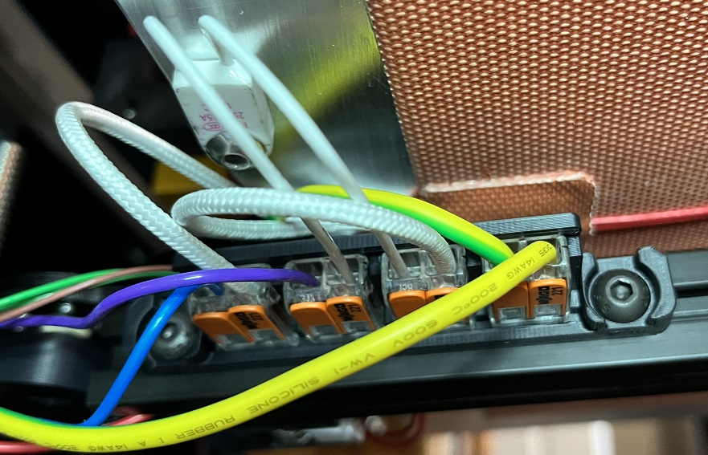

## Wago 4x 221-412 mount

This mount is to use four Wagos on the Voron Trident bed t-frame instead of three. The fourth one is for the bed thermister.

### Credit
This is a modification of the original Voron CAD work.

### File locations
- CAD folder -- F3D and STEP files
- Mesh folder -- 3MF and STL files

### BOM
- QTY=4 Wago 221 412 Lever Nuts
 (where build manual specifies QTY=3)
